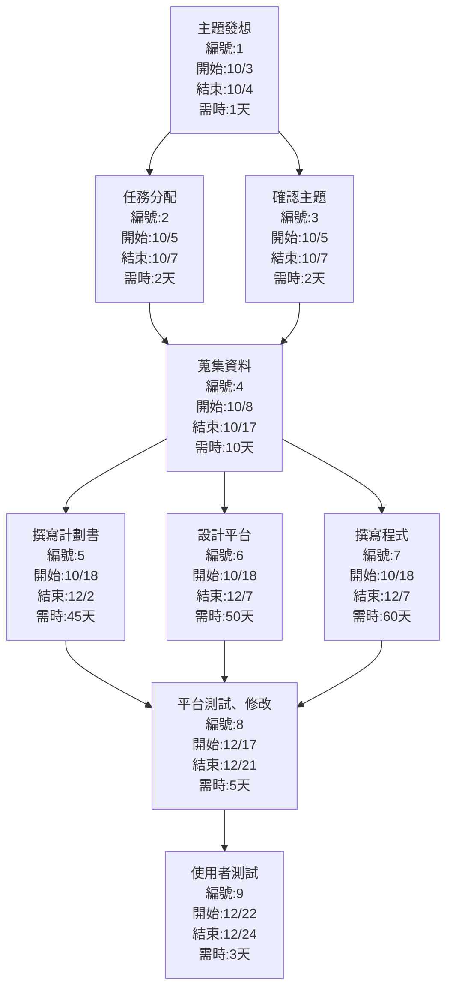
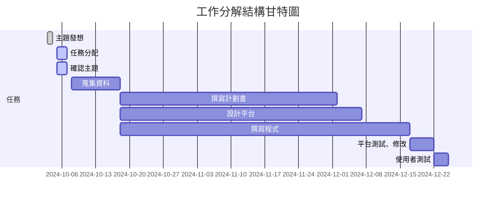

# 工作分解結構清單
| 任務 | 說明             | 需時 (天) | 前置任務  |
| ---- | ---------------- | --------- | --------- |
| 1    | 主題發想         | 1         | -         |
| 2    | 任務分配         | 2         | 1         |
| 3    | 確認主題         | 2         | 1         |
| 4    | 蒐集資料         | 10        | 2,3       |
| 5    | 撰寫計劃書       | 45        | 4         |
| 6    | 設計平台         | 50        | 4         |
| 7    | 撰寫程式         | 60        | 4         |
| 8    | 平台測試、修改   | 5         | 5,6,7     |
| 9    | 使用者測試       | 3         | 8         |

# PERT/CPM圖

# 甘特圖

