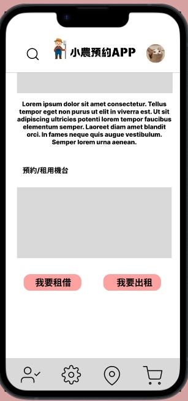
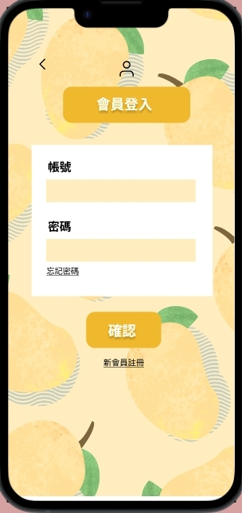
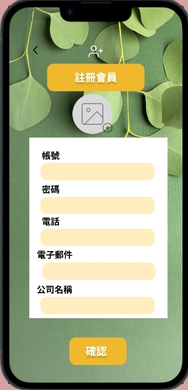
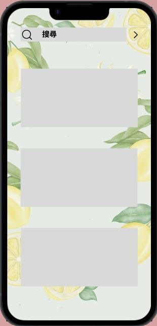
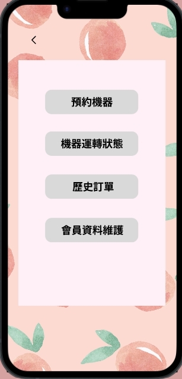
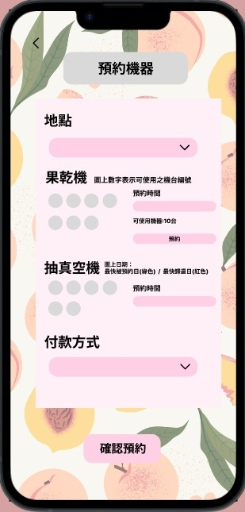
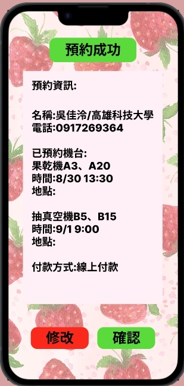
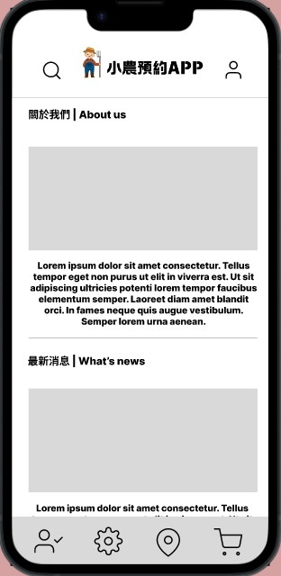

# 綠能電動農具租借APP

## 主頁面
使用者進入系統首要看到的畫面
功能選擇:1.瀏覽網站最新資訊 2.可下滑選擇租借機器 3.左上角可進入搜尋頁面 4.右上角可進行使用者登入作業 

## 使用者登入介面
使用者輸入帳號密碼即可登入，若忘記密碼可以按下方忘記密碼重新驗證設定密碼

## 註冊會員
尚未擁有帳號的使用者須建立基本資料即可註冊成功

## 搜尋頁面
提供各種可租借器具類的相關資訊，使用者也可以透過搜尋的方式直接找尋想要的機具

## 確認頁面
從主畫面點選進入左下角按鈕可進行以下確認
1.確認目前已預約的機器 2.確認機器運轉狀態 3.確認歷史訂單 4.會員資料維護

## 預約介面
從預約畫面中可選擇時間、地點、機器及付款方式 按下確認預約便會跳出預約資訊

## 預約資訊
確認預約後將會跳出預約資訊，使用者可選擇確認或需要修改

## 關於我們

